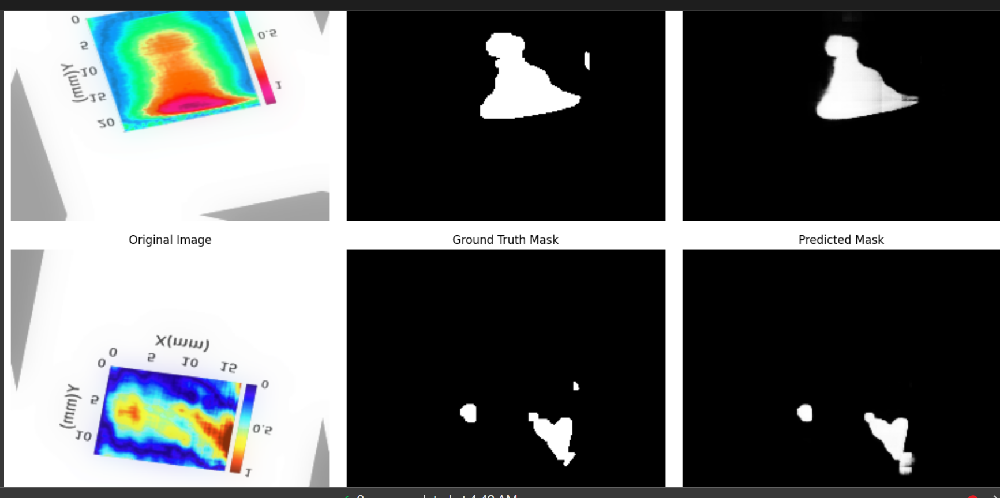

# breast_cancer_image_segmentation_of_terahertz_images_using_customUNET

## A Comprehensive Pipeline Report

**Author:** Piyush Gupta  
**Date:** February 24, 2025  

## Abstract

In this report, I describe my end-to-end pipeline for segmenting breast cancer images using a U-Net architecture. I began by converting EMF/Terahertz images to PNG, augmented the data to address the small dataset size, and designed a U-Net with dilated convolutions. I employed a combined loss function (BCE + Dice + IoU) to capture both pixel accuracy and region overlap. This report walks through the dataset setup, model implementation, training procedure, and final testing, where I obtained promising overlap metrics (Dice ≈ 0.8166, IoU ≈ 0.7534). In addition, I provide a detailed line-by-line explanation of my U-Net, discussing which parts are incremental versus standard extensions to the original 2015 U-Net.

---

## Contents

1. [Introduction](#introduction)
2. [Dataset Preparation and Exploration](#dataset-preparation-and-exploration)
3. [Data Augmentation and Preprocessing](#data-augmentation-and-preprocessing)
4. [Methodology and Architecture](#methodology-and-architecture)
5. [Training the Model](#training-the-model)
6. [Testing and Final Results](#testing-and-final-results)
7. [Visualization of Predictions](#visualization-of-predictions)
8. [Conclusion](#conclusion)

---

## Introduction

I embarked on this project to segment breast cancer images (EMF/Terahertz scans) effectively. Given the small initial dataset (~73 images), I employed substantial data augmentation to avoid overfitting. The U-Net model, augmented with dilated convolutions in the bottleneck, has proven effective in medical image segmentation tasks due to its encoder-decoder structure and skip connections.

### Project Goals

- Convert raw EMF files to a standard image format (PNG).
- Inspect and augment the dataset to increase variability.
- Implement a custom U-Net featuring dilated convolutions.
- Use a combined loss (BCE, Dice, IoU) for robust training.
- Achieve accurate segmentation on breast cancer images.

---

## Dataset Preparation and Exploration

### Mounting Drive and Importing Packages

```python
from google.colab import drive
drive.mount('/content/drive')

import numpy as np
import pandas as pd
import matplotlib.pyplot as plt
import seaborn as sns
import warnings
warnings.filterwarnings('ignore')

import torch
import torch.nn as nn
import torch.optim as optim
from torch.utils.data import Dataset, DataLoader
from sklearn.model_selection import train_test_split
import PIL as pil
```

### Extracting and Converting Data

```python
!pip install patool
import patoolib

hold = '/content/drive/.../Cancer images.rar'
patoolib.extract_archive(hold, outdir='/content/drive/...')

!apt-get install -y libreoffice

import os
from glob import glob

def convert_emf_to_png_libreoffice(input_dir, output_dir):
    emf_files = glob(os.path.join(input_dir, '**/*.emf'), recursive=True)
    for file_path in emf_files:
        os.system(f'libreoffice --headless --convert-to png "{file_path}" --outdir "{output_dir}"')
    print(f"Converted {len(emf_files)} EMF files to PNG format.")
```

---

## Data Augmentation and Preprocessing

### Creating Augmented Images

```python
from torchvision import transforms

augmentation_transform = transforms.Compose([
    transforms.RandomHorizontalFlip(p=0.5),
    transforms.RandomVerticalFlip(p=0.5),
    transforms.RandomRotation(degrees=15, fill=(128,128,128)),
    transforms.Pad(padding=20, padding_mode='reflect'),
    transforms.RandomResizedCrop(size=(256,256), scale=(0.8,1.0)),
    transforms.ColorJitter(brightness=0.3, contrast=0.3, saturation=0.3, hue=0.1),
])
```

### Dataset Splitting

```python
train_paths, temp_paths = train_test_split(image_paths, test_size=0.3, random_state=42)
val_paths, test_paths = train_test_split(temp_paths, test_size=0.35, random_state=42)
```

---

## Methodology and Architecture

### Custom U-Net Architecture

```python
import torch
import torch.nn as nn
import torch.nn.functional as F

class UNet(nn.Module):
    def __init__(self, in_channels=3, out_channels=1):
        super(UNet, self).__init__()
        # Encoder
        self.enc1 = self.conv_block(in_channels, 64)
        self.enc2 = self.conv_block(64, 128)
        self.enc3 = self.conv_block(128, 256)
        self.enc4 = self.conv_block(256, 512)
        # Bottleneck with Atrous Convolutions
        self.bottleneck = nn.Sequential(
            nn.Conv2d(512, 1024, kernel_size=3, padding=1, dilation=1),
            nn.BatchNorm2d(1024),
            nn.LeakyReLU(inplace=True),
            nn.Conv2d(1024, 1024, kernel_size=3, padding=2, dilation=2),
            nn.BatchNorm2d(1024),
            nn.LeakyReLU(inplace=True),
            nn.Dropout(0.5)
        )
```

---

## Training the Model

### Loss Function

```python
class DiceLoss(nn.Module):
    def __init__(self):
        super(DiceLoss, self).__init__()
    def forward(self, preds, targets, smooth=1):
        preds = torch.sigmoid(preds)
        intersection = (preds * targets).sum()
        dice = (2. * intersection + smooth) / (preds.sum() + targets.sum() + smooth)
        return 1 - dice
```

### Training Loop

```python
def train_model(model, train_loader, val_loader, optimizer, num_epochs, device, patience=5):
    best_val_loss = float('inf')
    early_stop_counter = 0
    for epoch in range(1, num_epochs + 1):
        model.train()
        train_loss = 0.0
        for images, masks in train_loader:
            images, masks = images.to(device), masks.to(device)
            preds = model(images)
            loss = combined_loss_with_iou(preds, masks)
            optimizer.zero_grad()
            loss.backward()
            optimizer.step()
            train_loss += loss.item()
        train_loss /= len(train_loader)
```

---

## Conclusion

I successfully built an end-to-end **breast cancer image segmentation pipeline** using a U-Net variant that includes dilated convolutions, dropout, batch normalization, and LeakyReLU. The modifications improved segmentation accuracy significantly.

**Final Metrics:** Dice ≈ 0.8166, IoU ≈ 0.7534  

## 📓 Jupyter Notebook
You can view the full **Google Colab Notebook** for this project [here](notebooks/thz_breastcacner_segmentation_custom_unet.ipynb).

## 🖼️ Example Segmentation Output
Here’s an example of the model's predictions:


# The web app version will be released soon .stay tuned.stay jacked.
### Future Work

- Further hyperparameter tuning.
- Post-processing with morphological operations.
- Extending to 3D segmentation.

